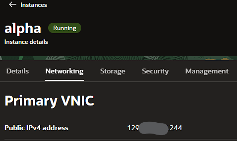

# OCI-cloud-VM-setup

Creating and hardening of OCI's free tier VMs
Oracle Cloud Infrastructure offers a generous free tier that's hard to beat.
For this project we'll focus on their free VMs:
2 AMD based Compute VMs with 1 OCPU and 1 GB memory each
Arm-based Ampere A1 cores and 24 GB of memory usable as 1 VM or 2 VMs — we'll be using 1 VM with 4 OCPUS and 24 GB RAM.

We'll create an AMD VM and call it "alpha"

## OS & Shape

- OS: Ubuntu 24.04 Minimal
- Shape: VM.Standard.E2.1.Micro
- Shape build: Virtual machine, 1 core OCPU, 1 GB memory, 0.48 Gbps network bandwidth
- Storage: 47GB

## Networking:

I've already created a virtual cloud network (VCN) so I'll use that one instead of creating a new one.Same for the subnet.

I will choose to not automatically set a public IP address and will set it later so it's permanent and doesn't change on VM reboot.

To get access to the VM we'll need to use ssh, so I made a key pair then pasted my public key, it will be place in the right place in the VM's authorized_keys directory.

To make a key pair I used
ssh-keygen -t ed25519

Everything else can be left at default settings.

## Reserving a public IP address

We'll go into the OCI dashboard and reserve a public IP address for our VM.

We can then come back to the instance's VNIC setting and assign that IP address to the alpha instance.

Now the Public IP address will not change after we shut down the VM.

## Login into the VM

Since the VM already has our public ssh key, we can log in using :

ssh -i "path-to-private-key" ubuntu@public-ip-address

## First steps once you are in

First we'll update everything with sudo apt update && sudo apt upgrade
